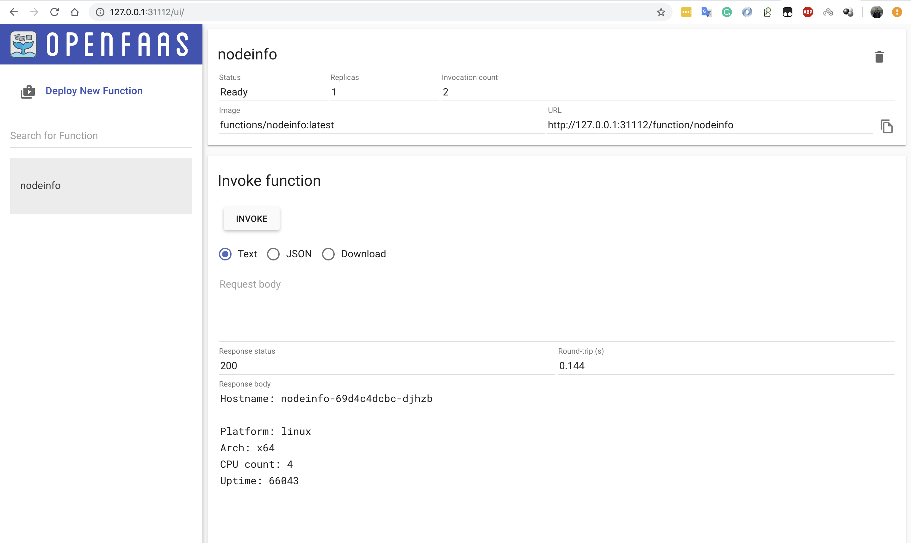

# 在 macOS 上部署 OpenFaaS

## 准备

* [Install Docker Desktop on Mac](https://docs.docker.com/docker-for-mac/install/)
* [Install Kubernetes for Mac](https://thenewstack.io/how-to-install-docker-desktop-with-kubernetes-on-macos/)

## 安装 OpenFaaS

安装 faas-cli

```bash
curl -sL https://cli.openfaas.com | sudo sh
```

安装命名空间

```bash
git clone https://github.com/openfaas/faas-netes
kubectl apply -f faas-netes/namespaces.yml
```

为 gatway 创建一个随机密码

```bash
# generate a random password
PASSWORD=$(head -c 12 /dev/urandom | shasum| cut -d' ' -f1)
echo $PASSWORD
kubectl -n openfaas create secret generic basic-auth \
--from-literal=basic-auth-user=admin \
--from-literal=basic-auth-password="$PASSWORD"
```

部署 openfaas

> 这个过程会从dockerhub上下载镜像所以会比较慢

```bash
cd faas-netes && kubectl apply -f ./yaml
```

设置URL访问地址，例如想通过 31112 端口访问

```bash
kubectl port-forward svc/gateway -n openfaas 31112:8080 &
```

设置登录地址和密码

```bash
export OPENFAAS_URL=http://127.0.0.1:31112
echo -n $PASSWORD | faas-cli login --password-stdin
```

在浏览器打开 OpenFaaS控制台

```bash
http://127.0.0.1:31112
```




