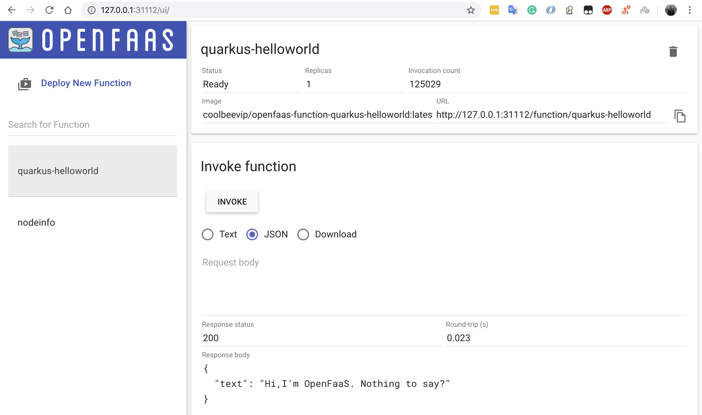
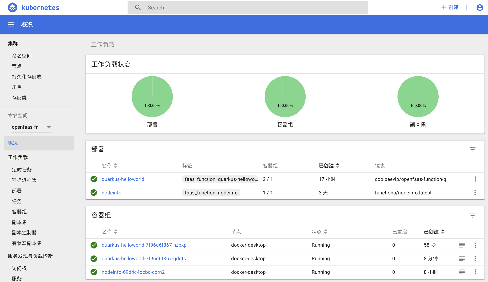
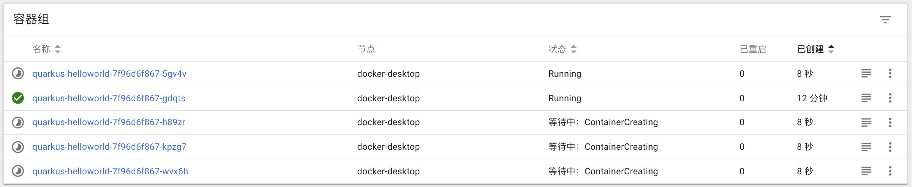
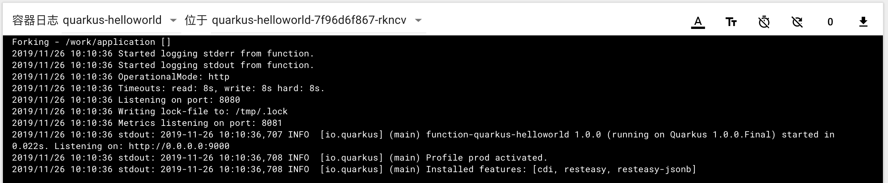

# OpenFaaS : Quarkus Native Application

## 创建一个 Quarkus 应用

>  Quarkus Application 可以参考 https://quarkus.io/guides/getting-started

启动服务

```bash
$ cd function-quarkus-helloworld
./mvnw compile quarkus:dev
```

测试服务

```bash
$ curl -H "Content-Type:application/json" -X POST -d '{"text": "Hello"}' http://127.0.0.1:9000
{"text":"Hi,I'm OpenFaaS. I have received your message 'Hello'"}
```

## 编译 Native Docker Images

多阶段编译本地应用镜像

```bash
$ docker build -f src/main/docker/Dockerfile.multistage -t coolbeevip/openfaas-function-quarkus-helloworld .
```

启动本地镜像

```bash
$ docker run -p 8080:8080 coolbeevip/openfaas-function-quarkus-helloworld:latest
Forking - /work/application []
2019/11/25 14:22:12 Started logging stderr from function.
2019/11/25 14:22:12 Started logging stdout from function.
2019/11/25 14:22:12 OperationalMode: http
2019/11/25 14:22:12 Timeouts: read: 25s, write: 25s hard: 20s.
2019/11/25 14:22:12 Listening on port: 8080
2019/11/25 14:22:12 Writing lock-file to: /tmp/.lock
2019/11/25 14:22:12 Metrics listening on port: 8081
2019/11/25 14:22:12 stdout: 2019-11-25 14:22:12,592 INFO  [io.quarkus] (main) function-quarkus-helloworld 1.0.0-SNAPSHOT (running on Quarkus 0.25.0) started in 0.008s. Listening on: http://0.0.0.0:9000
2019/11/25 14:22:12 stdout: 2019-11-25 14:22:12,592 INFO  [io.quarkus] (main) Profile prod activated. 
2019/11/25 14:22:12 stdout: 2019-11-25 14:22:12,592 INFO  [io.quarkus] (main) Installed features: [cdi, resteasy]
```

测试镜像服务

```bash
$ curl -H "Content-Type:application/json" -X POST -d '{"text": "Hello Docker"}' http://127.0.0.1:8080
{"text":"Hi,I'm OpenFaaS. I have received your message 'Hello Docker'"}
```

## 上传镜像到 DockerHub

在 DockerHub上创建仓库 openfaas-function-quarkus-helloworld

登录 Docker Hub

```bash
$ docker login
```

上传镜像

```bash
$ docker push coolbeevip/openfaas-function-quarkus-helloworld
```

## 部署到 OpenFaaS

登录 OpenFaaS

```bash
$ export OPENFAAS_URL=http://127.0.0.1:31112
$ faas-cli login --password 78b1d4c29831bbd9040d2ffe6da2c9b9c7845bf2
```

部署

```bash
$ faas-cli deploy stack.yml 
Deploying: quarkus-helloworld.
WARNING! Communication is not secure, please consider using HTTPS. Letsencrypt.org offers free SSL/TLS certificates.

Deployed. 202 Accepted.
URL: http://127.0.0.1:31112/function/quarkus-helloworld
```

查看部署UI

> 在浏览器打开 http://127.0.0.1:31112

可以看到 quarkus-helloworld 已经部署完毕，选择 JSON 后点击 INVOKE 按钮可以测试函数



打开 K8s 控制台可以看到函数已经部署并拉起



命令行测试

> 在命令行中输入以下命令进行测试

```bash
$ curl -H "Content-Type:application/json" -X POST -d '{"text": "Hello Serverless"}' http://127.0.0.1:31112/function/quarkus-helloworld
{"text":"Hi,I'm OpenFaaS. I have received your message 'Hello Serverless'"}
```

压力测试

> 模拟 50 并发调用 5万次

```bash
$ echo '{"text": "Hello Serverless"}' > data.json
$ ab -n 50000  -c 50 -p 'data.json' -T 'application/json' http://127.0.0.1:31112/function/quarkus-helloworld
```

在K8S控制台可以看到副本自动增加



观察日志可以看到单个镜像服务启动耗时22毫秒




